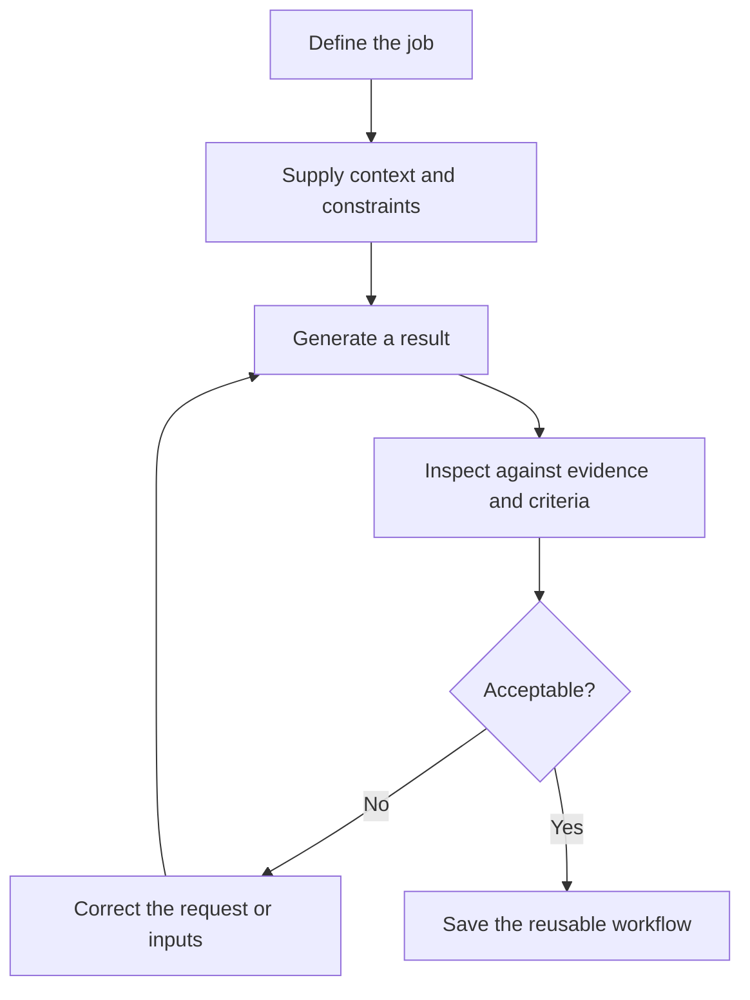

# Human-guided iteration

Ralphing starts as a feedback system. A model proposes work; a human or a
machine-checkable test compares that work with a desired state; the next
iteration receives the correction and tries again.

## What improves across iterations

- **The specification:** vague intent becomes explicit requirements.
- **The evidence:** missing or irrelevant context is corrected.
- **The output contract:** the result becomes easier to consume and compare.
- **The evaluator:** subjective reactions become observable criteria.
- **The operator:** the human learns which parts require judgment.

The model is not the only thing being refined. The human's understanding of the
job also improves. That is why useful prompt work often resembles requirements
engineering more than copywriting.

## A loop needs state

For small work, conversation history may be enough. Durable work should retain:

- the current goal and constraints;
- source data and provenance;
- decisions already made;
- unresolved questions;
- acceptance criteria;
- results of earlier attempts; and
- a clear next unit of work.

At higher autonomy, that state should live outside the model's context window
in specifications, plans, tests, logs, and version control.

## Escalating autonomy

Do not equate better prompting with more autonomy. A workflow can progress from:

1. one answer reviewed by a person;
2. several deliberate human-guided iterations;
3. a reusable prompt plus scorecard;
4. a scripted workflow with approval points;
5. a bounded agentic loop; and
6. an unrestricted loop operated inside deliberate containment.

The advanced stages are legitimate engineering techniques. They also enlarge
the consequences of a bad specification, inadequate verification, or excessive
tool access.

